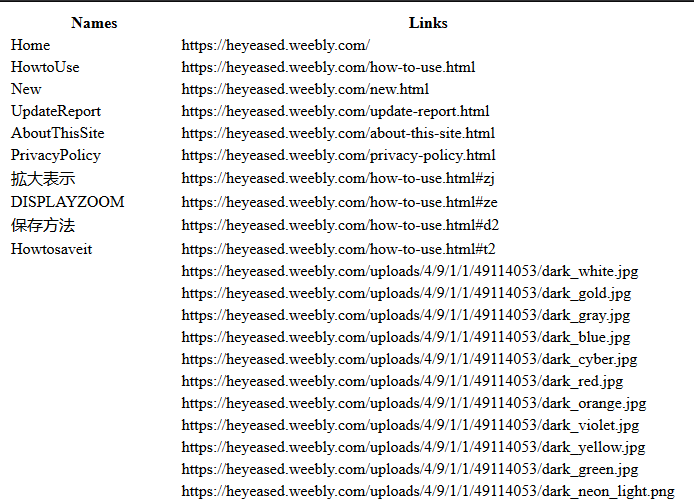
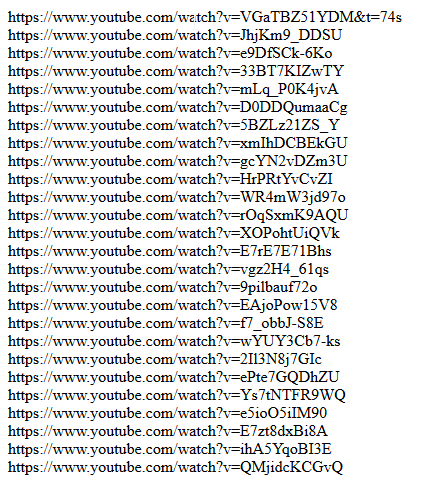

# Get All Links | 获取全部链接
## Description
Get all links from a website, change @match to the website to which you want to get links. 
获取网页中的全部链接，将 @match 改到你想获得链接的网站。  
## Screenshot


## Example
### Get all links from a youutbe channel
1. change `@match` to `https://youtube.com/*`
2. change regex to `watch`
```javascript
const name_regex = new RegExp(/watch/g);
```
